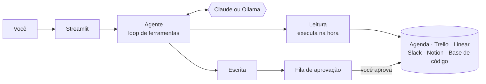

# 🤖 Jarvis: Assistente Pessoal com IA Generativa

> Projeto do Lab **"Construa Seu Assistente Virtual Com Inteligência Artificial"** da [DIO](https://www.dio.me/), feito a partir do [repositório base](https://github.com/digitalinnovationone/dio-lab-bia-do-futuro).

Inspirado no J.A.R.V.I.S. do Homem de Ferro, o **Jarvis** é um assistente pessoal para quem trabalha com tecnologia. Ele atua em três frentes:

| | Frente | O que faz |
|---|---|---|
| 📅 | **Agenda semanal** | Todo domingo, cruza agenda, tarefas e mensagens, monta a programação da semana e propõe blocos de foco com **alertas no Google Agenda** |
| 🧰 | **Ferramentas** | Consulta e organiza **Trello, Linear, Slack e Notion**: o que vence, quem pediu o quê, cria cartões, issues, mensagens e páginas |
| 💻 | **Programação** | Tira dúvidas de **web, Python, Node.js, PHP e C#** com base numa base de conhecimento curada, citando a fonte |

E ele **nunca age sozinho**: toda ação de escrita fica aguardando a sua aprovação.

```
Você:   Cria um evento amanhã às 10h para revisar o PR da Bruna.

Jarvis: Preparei "Revisar PR da Bruna (ENG-150)" na segunda, 12/10, das 10:00 às 11:00, com alerta
        15 min antes. Está aguardando sua aprovação na barra lateral.      [ Aprovar ] [ Recusar ]
```
<sub>Exemplo ilustrativo do comportamento esperado, com os dados simulados.</sub>

---

## 🧠 Como funciona



- **O LLM usa ferramentas** (*tool use*) para consultar dados em vez de "lembrar" ou inventar.
- **A base de programação** (7 arquivos Markdown) é pesquisada por seção, e cada trecho volta com a fonte (`php.md > Segurança`).
- **As ações de escrita** viram itens numa fila de aprovação. Essa garantia está no código, não só no prompt.
- **O código valida as propostas:** um evento com conflito de horário ou no passado volta como erro, e o modelo corrige.
- **Modo demo** com dados simulados realistas (datas relativas, sempre na semana atual) ou **modo real** com as APIs das cinco ferramentas.

---

## 🗺️ Os 6 passos do desafio

| # | Passo | Onde está | Destaques |
|---|---|---|---|
| 1 | Documentação | [docs/01-documentacao-agente.md](docs/01-documentacao-agente.md) | Persona Jarvis, arquitetura e 8 estratégias de segurança |
| 2 | Base de conhecimento | [docs/02-base-conhecimento.md](docs/02-base-conhecimento.md) · [data/](data/) | Web, Python, Node.js, PHP, C#, boas práticas e produtividade |
| 3 | Prompts | [docs/03-prompts.md](docs/03-prompts.md) | Prompt da Bia adaptado: 7 regras, rotina de domingo e few-shot |
| 4 | Aplicação | [src/](src/) · [docs/06-integracoes.md](docs/06-integracoes.md) | Streamlit + 10 ferramentas + aprovação + cron de domingo |
| 5 | Avaliação | [docs/04-metricas.md](docs/04-metricas.md) · [tests/](tests/) | 36 testes sem LLM e 13 casos com LLM nas 3 métricas |
| 6 | Pitch | [docs/05-pitch.md](docs/05-pitch.md) | Roteiro de 3 minutos com demo |

---

## 🚀 Como rodar

Requer **Python 3.10+**.

```bash
git clone <url-do-seu-fork>
cd dio-lab-bia-do-futuro

python -m venv .venv
source .venv/bin/activate            # Windows: .venv\Scripts\activate
pip install -r requirements.txt

cp .env.example .env                 # escolha UMA opção de LLM abaixo
```

**Opção A, Claude (API da Anthropic):** coloque sua chave em `ANTHROPIC_API_KEY`.

**Opção B, Ollama (local e gratuito):** instale o [Ollama](https://ollama.com), rode `ollama pull qwen2.5` e defina `LLM_PROVIDER=ollama`. Use um modelo com suporte a ferramentas.

```bash
streamlit run src/app.py             # interface web em http://localhost:8501
python src/agente.py                 # ou pelo terminal
```

💡 Para ver o fluxo de domingo em qualquer dia, adicione `JARVIS_HOJE=2026-10-11` ao `.env`.

🔌 Para conectar suas contas reais (Google Agenda, Trello, Slack, Linear e Notion) e agendar o planejamento de domingo no cron, veja [docs/06-integracoes.md](docs/06-integracoes.md).

### Testes e avaliação

```bash
python -m unittest                   # 36 testes, não precisa de LLM
python src/avaliacao.py              # 13 casos com o LLM; gera docs/resultados-avaliacao.md
```

---

## 📁 Estrutura

```
├── data/
│   ├── perfil_usuario.json          # Usuário fictício (Alex): expediente, foco, stack
│   ├── conhecimento/                # Base de programação e produtividade (Markdown)
│   └── mock/                        # Agenda, Trello, Linear, Slack e Notion simulados
├── docs/                            # Os 6 passos + guia de integrações
├── src/
│   ├── app.py                       # Interface Streamlit
│   ├── agente.py                    # Prompt + loop de ferramentas (Claude/Ollama)
│   ├── ferramentas.py               # Ferramentas + fila de aprovação
│   ├── conhecimento.py              # Busca na base
│   ├── integracoes/                 # Conectores simulados e reais
│   ├── planejamento_semanal.py      # Planejamento automático (cron)
│   └── avaliacao.py                 # Avaliação com casos_teste.json
└── tests/                           # Testes sem LLM
```

---

## ⚠️ Limitações

- O Jarvis cria e consulta, mas não edita nem apaga eventos e tarefas. Também não executa código.
- A base de programação é enxuta. Fora dela, ele responde com conhecimento geral e avisa.
- Os conectores reais foram testados com respostas simuladas, mas ainda não com contas reais.
- Veja a lista completa em [docs/01-documentacao-agente.md](docs/01-documentacao-agente.md#limitações-declaradas).

## 🛠️ Tecnologias

Python · Streamlit · [Claude API](https://docs.claude.com) (`claude-opus-5-5`, tool use) · Ollama · Google Calendar API · APIs de Trello, Slack, Linear e Notion
