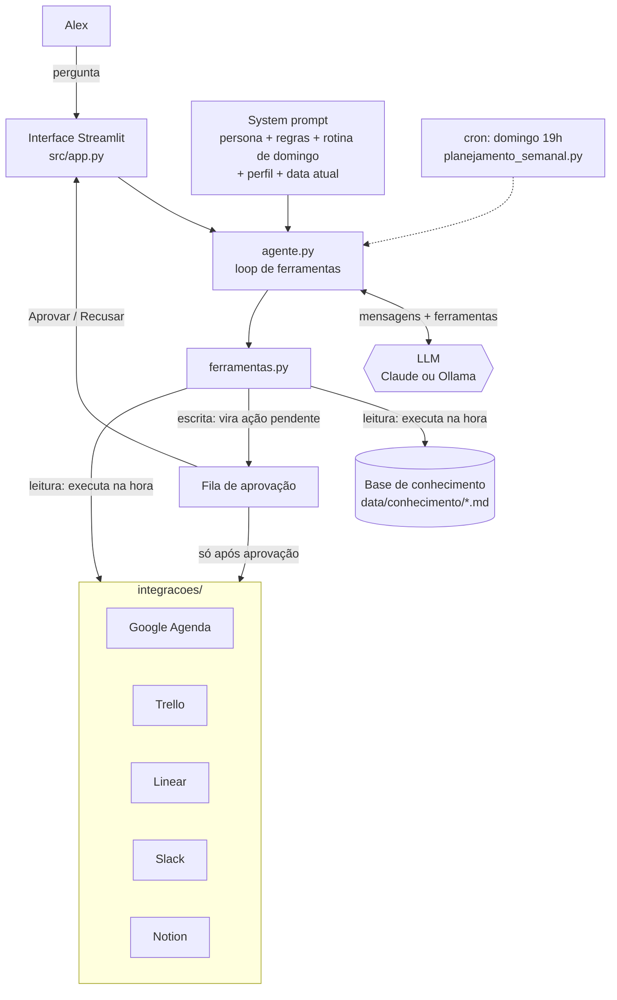

# Documentação do Agente

## Caso de Uso

### Problema
> Qual problema seu agente resolve?

Quem desenvolve software passa o dia alternando entre contextos: a agenda no Google, as tarefas no Trello e no Linear, os pedidos no Slack, a documentação no Notion e, no meio disso tudo, o código. Cada troca custa foco. O resultado é conhecido: a semana começa sem plano, prazos são lembrados em cima da hora, pedidos no Slack se perdem e o tempo de trabalho profundo é engolido por reuniões.

### Solução
> Como o agente resolve esse problema de forma proativa?

O **Jarvis**, inspirado no assistente do Homem de Ferro, é um assistente pessoal que concentra essas frentes numa única conversa:

1. **Agenda semanal:** todo domingo, ele cruza agenda, tarefas e mensagens e **monta a programação da semana** com blocos de foco para as tarefas prioritárias. Em seguida, propõe criar os eventos com **alertas no Google Agenda**.
2. **Ferramentas de trabalho:** consulta e organiza **Trello, Linear, Slack e Notion**. Responde a perguntas como "quais tarefas vencem esta semana?", cria cartões e issues, envia mensagens e salva o plano da semana numa página do Notion.
3. **Programação:** tira dúvidas de **web (HTML/CSS/JS), Python, Node.js, PHP e C#** com base numa base de conhecimento curada, sempre citando a fonte.

É proativo: ao planejar, percebe que a issue urgente vence na terça e que alguém pediu uma revisão no Slack até quinta, e encaixa as duas antes do prazo. E é **seguro por design**: nada é criado ou enviado sem a aprovação explícita da pessoa.

### Público-Alvo
> Quem vai usar esse agente?

Pessoas desenvolvedoras (e quem trabalha com tecnologia de forma geral) que usam Google Agenda, Trello, Linear, Slack e Notion no dia a dia. O usuário fictício da demonstração é **Alex Souza**, desenvolvedor full stack com stack principal Python e Node.js, que prefere trabalho profundo pela manhã ([`data/perfil_usuario.json`](../data/perfil_usuario.json)).

---

## Persona e Tom de Voz

### Nome do Agente
**Jarvis**

### Personalidade
> Como o agente se comporta?

Inspirado no J.A.R.V.I.S.: eficiente, antecipa necessidades e tem cortesia elegante, com um toque de humor sutil, sem nunca bajular. É consultivo: propõe o plano e a pessoa decide. Aponta **um** ponto de atenção por resposta, para não sobrecarregar.

### Tom de Comunicação
> Formal, informal, técnico, acessível?

Profissional e cordial, em português do Brasil. Técnico na medida certa ao falar de código, sempre com blocos de código identificados pela linguagem. Respostas objetivas, com tabelas quando ajudam (ex.: o plano da semana).

### Exemplos de Linguagem
- Saudação: "Às suas ordens, Alex. Posso organizar sua semana, consultar suas ferramentas ou ajudar com código. Por onde começamos?"
- Confirmação: "Proponho três blocos de foco. Eles estão aguardando sua aprovação na barra lateral."
- Erro/Limitação: "Não encontrei nenhuma reunião com o marketing na sua agenda desta semana. Quer que eu procure em outro período?"
- Fora do escopo: "Futebol foge da minha especialidade, Alex. Posso, no entanto, conferir sua agenda de amanhã."

---

## Arquitetura

### Diagrama

### Componentes

| Componente | Descrição |
|------------|-----------|
| Interface | Chat em **Streamlit** (`src/app.py`), com barra lateral de aprovação de ações, botão "Planejar minha semana" e aviso aos domingos. Também há um modo terminal (`python src/agente.py`). |
| LLM | **Claude** (`claude-opus-5-5`) via API da Anthropic, com *tool use*, ou um modelo local via **Ollama** (ex.: `qwen2.5`), também com ferramentas. |
| Ferramentas | 10 ferramentas (`src/ferramentas.py`): 5 de leitura (base de conhecimento, eventos, tarefas, Slack, Notion) e 5 de escrita (evento, cartão, issue, mensagem, página). Os schemas usam `strict` para garantir parâmetros válidos. |
| Base de Conhecimento | 7 arquivos Markdown de programação e produtividade, com busca por relevância em cada seção (`src/conhecimento.py`). |
| Integrações | Cada ferramenta externa tem uma versão **simulada** (padrão, dados em `data/mock/`) e uma **real** (`src/integracoes/reais.py`), ativada por credenciais no `.env`. |
| Validação | Aprovação humana obrigatória para escrita, checagem de conflito de horário e de datas no passado, regras anti-alucinação no prompt e 36 testes automáticos (sem LLM), além de 13 casos de avaliação com LLM. |
| Agendamento | `src/planejamento_semanal.py` roda o planejamento sem interface, pronto para o cron de domingo. |

---

## Segurança e Anti-Alucinação

### Estratégias Adotadas

- [x] **Dados reais só via ferramentas:** o Jarvis não "lembra" a agenda. Ele consulta, e o prompt proíbe inventar eventos, prazos, IDs ou nomes.
- [x] **Fonte obrigatória nas respostas de programação** (ex.: "(fonte: php.md > Segurança)"). Fora da base, ele avisa "fora da minha base — confira na documentação oficial".
- [x] **Proibição explícita de inventar funções e APIs.** A base registra armadilhas reais, como a função `array_flatten`, que não existe no PHP.
- [x] **Aprovação humana no código, não só no prompt:** ferramentas de escrita nunca executam direto. Elas viram ações pendentes que só rodam com o clique em "Aprovar" (ou "s" no terminal). Mesmo que o modelo erre, nada é criado sem permissão.
- [x] **Validação antes de propor:** eventos com conflito de horário, no passado ou com fim antes do início são recusados com o motivo, e o modelo precisa corrigir.
- [x] **Proteção de segredos:** o Jarvis nunca pede nem guarda tokens ou senhas e recomenda revogar o que for colado no chat. As credenciais ficam no `.env`, fora do Git.
- [x] **Escopo definido:** fora de agenda, ferramentas e programação, ele redireciona com gentileza.
- [x] **Robustez:** o código trata recusa do modelo (com *fallback* automático no servidor), limite de passos, falhas de API das integrações e falta de credenciais, sempre com mensagens claras.

### Limitações Declaradas
> O que o agente NÃO faz?

- Não executa nada sem aprovação: não cria eventos, não envia mensagens e não altera tarefas sozinho.
- Não executa código nem comandos no computador da pessoa; ele sugere e explica.
- Não edita nem apaga eventos, cartões ou issues existentes (o protótipo só cria e consulta).
- A base de programação é **curada e enxuta**. Fora dela, o Jarvis usa conhecimento geral e avisa.
- No Slack real, lê apenas o canal configurado (não faz busca global de menções).
- O planejamento automático do domingo **propõe** o plano. A criação dos eventos depende de aprovação ou da flag `--aprovar-tudo`.
